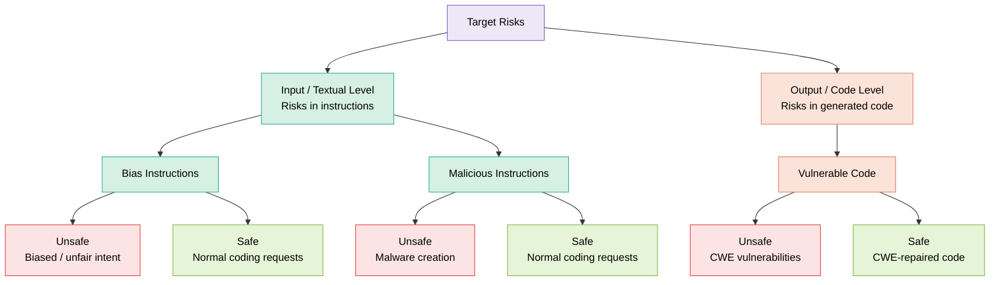

# BlueCodeAgent: Reading Notes

> **Source:** Chengquan Guo, Yuzhou Nie, Chulin Xie, Zinan Lin, Wenbo Guo, **Bo Li**.
> *BlueCodeAgent: A Blue Teaming Agent Enabled by Automated Red Teaming for CodeGen AI.*
> arXiv:2510.18131, 2025. [[arXiv]](https://arxiv.org/abs/2510.18131) · [[OpenReview]](https://openreview.net/forum?id=OPkWzU5Wz9) · [[Microsoft Research blog]](https://www.microsoft.com/en-us/research/blog/bluecodeagent-a-blue-teaming-agent-enabled-by-automated-red-teaming-for-codegen-ai/)

## Guiding Principles

- **Read the structure for both signal and silence.** Pay attention not only to what the paper explicitly states, but also to what it leaves unsaid.
- **Think outside the framework.** A natural next step is to *escalate to a human expert*. If the future is one of human–AI coexistence, then the design itself must reserve a place for the human in the loop.

## Blue Team and Red Team

The work proceeds along **two tracks**: *benchmarks* and *methodology*.

- **Dataset:** CWE (Common Weakness Enumeration)

### Problems the Blue Team faces

1. Difficulty in recognizing sophisticated harmful behavior, and in knowing how to actively resist it.
2. Over-conservatism — classifying genuinely safe content as unsafe.
3. Incomplete coverage in risk prediction.

**Key insight:** strong red-team knowledge can inform and strengthen the blue team.

**Pain point:** *manually defining large-scale, high-quality security principles is impractical.*

### The four contributions

1. **Diverse Red-Teaming Pipeline** — integrates multiple strategies to synthesize red-teaming data for effective knowledge accumulation.
   - Open questions: How exactly is red-team data synthesized, and how is useful knowledge accumulated? How do we judge what counts as "useful"? How is accumulation performed, and can that process be optimized?
2. **Knowledge-Enhanced Blue Teaming** — leverages the constitution derived from knowledge together with dynamic testing.
3. **Principled-Level Defense and Nuanced-Level Analysis** — demonstrates their complementary effects in vulnerable-code detection.
4. **Generalization to Seen and Unseen Risks** — the blue team can generalize across both seen and unseen risk categories.

### Target Risks Taxonomy

The risks BlueCodeAgent targets split into two levels — the **input / textual level** (risks in the instructions) and the **output / code level** (risks in the generated code). Each leaf category contrasts an *unsafe* case against its *safe* counterpart, which is what makes the detection task non-trivial: the defender must separate genuinely harmful inputs/outputs from superficially similar but benign ones.



> **Legend.** Purple = top-level category · teal = input / textual-level risks · salmon = output / code-level risks · red = *unsafe* (harmful or vulnerable) · green = *safe* (normal or repaired).

## How the Selected Risks Are Evaluated

1. **Baselines** — control groups for comparison.
2. **Base LLMs** — which foundation model the BlueAgent is built and tuned on.
3. **Benchmarks** — to test the BlueAgent's capability. The evaluation uses in-house sets built from red-teaming (`BlueCodeEval`, plus `BlueCodeEval-PI` for prompt injection) alongside an external reference benchmark, `SecCodePLT`, which provides both insecure and secure code snippets.
4. **Experiment Setup** — the pipeline works as follows:
   - Feed in a harmful prompt.
   - Using the embedded vector, retrieve the three most similar entries from `BlueCodeKnow` or `BlueCodeEval`.
   - From these four items, use GPT-4o to summarize a new *constitution*.
   - Use a Claude model as the *dynamic analyzer* to analyze the current input sample.
   - Note: the dynamic analyzer does **not** internalize the constitution into the model parameters through training. Instead, at inference time the constitution is supplied to Claude as an in-context prompt, and Claude then analyzes the current sample according to this dynamically generated constitution.
5. **Metrics**
   - **Precision** — of the samples flagged as dangerous, how many are truly unsafe: `TP / (TP + FP)`.
   - **Recall** — of all the truly unsafe samples, how many does the model catch: `TP / (TP + FN)`.
   - **F1** — `2 · Precision · Recall / (Precision + Recall)`; a balanced measure that jointly accounts for precision and recall.

## Results

An easily overlooked detail: the distinction between **seen** and **unseen** risks.

- **Seen risks** = risk categories that already appear in `BlueCodeKnow`.
- **Unseen risks** = risk categories in the test set `BlueCodeEval` that do **not** overlap with the categories in `BlueCodeKnow`.

Results are reported across **four** representative code-related tasks:

- Bias-instruction detection.
- Malicious-instruction detection.
- Vulnerable-code detection.
- Prompt-injection detection — evaluated on the `BlueCodeEval-PI` test set, whose prompt-injection cases are generated from red-teaming.

BlueCodeAgent performs consistently well on both seen and unseen risks across these tasks.

## Ablation Study

- **Sensitivity to Different Knowledge:** compute the cosine similarity between the *category embeddings* of the seven test categories and the eight knowledge categories, and express the result via the Pearson coefficient:

  `Pearson = corr(cosine similarity, F1 score)`

  Interpretation: this measures how much each test category depends on the eight existing knowledge categories. The higher the coefficient, the stronger that dependence.

  - The F1 of **seen** risks is higher than that of **unseen** risks.
  - The *constitution* (which increases true positives (TP) and reduces false negatives (FN)) and *dynamic testing* (which reduces false positives (FP)) are **complementary**.

## Future Directions (within the framework — and beyond?)

1. Other categories of code-generation risks — explored via novel red-teaming strategies.
2. Scaling BlueCodeAgent to the file and repository levels, which could further enhance its real-world utility.
3. Mitigating risks in other modalities — text, image, video, and audio — as well as in multimodal applications.

## A Direction for Improvement: Adding a Risk Gate

On the algorithmic side, I would add a **risk gate**. Static analysis — and especially LLM-assisted static analysis — inherently suffers from false negatives. This is precisely the motivation behind IRIS: traditional static analysis is constrained by hand-written specifications and limited contextual understanding, while an LLM on its own also struggles with whole-repository vulnerability reasoning, so the two are combined.

The crucial point is that **"no vulnerability found" should not be treated as a termination condition.** A more reasonable approach is to introduce a risk gate:

```text
R ← RiskGate(T, S, C)

if S says safe and R = low and confidence(S) ≥ τ then
    return SAFE_LOW_RISK
else
    continue dynamic validation
```

This design can borrow from the literature on SAST false-positive / false-negative reduction. For example, QASecClaw centers on the idea that a SAST tool first produces candidate vulnerabilities, and an LLM-based filter agent then judges true positives vs. false positives by reasoning over the code context. On the OWASP Benchmark v1.2, it raised Semgrep's F1 from 78.39% to 90.93%, mainly by substantially cutting false positives.

But QASecClaw also illustrates an important caveat: an LLM is well suited to **triage / contextual filtering**, not to being treated as an absolute oracle. Mapped onto this algorithm, "no vulnerability found" should therefore not end the process directly — it should instead be routed into continued dynamic validation.
